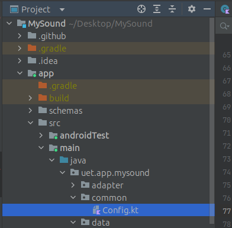
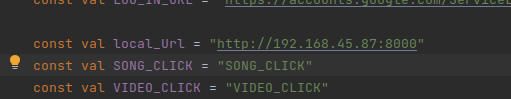

# BeMusic

## 1. Yêu cầu:
để run project yêu cầu các thứ sau:
- cài composer php
- cái node js 
- cài xampp.

sau khi cài xammpp, cấu hình lại file php.ini xóa bỏ dấu ";" trước ``extension=pdo_sqlite``

## 2. Cấu hình môi trường.
Thêm file .env
 ; copy từ file .env.example:  

    cp .env.example .env
vào file .env và 
        
    DB_CONNECTION=mysql
    DB_HOST=127.0.0.1
    DB_PORT=3306
    DB_DATABASE=music1
    DB_USERNAME=root
    DB_PASSWORD=
* cấu hình đúng để kết nối đến mysql trên máy
Tên user name và password đúng database tạo mới;

sau đó cài thư viện dùng lệnh

    composer install --ignore-platform-req=php

sau đó chạy các lệnh

    php artisan migrate
    php artisan sound:init
    đến đoạn PATH thì gõ C:\

    Chạy server:
    php artisan serve --host=ipaddress

    user: admin@sound.dev
    password: sound123

## 3. Hướng dẫn chạy bên front-end

    `sau khi clone project mysound, vào thư mục src/common/config.kt 
    

    `chạy server`
        - kiểm tra địa chỉ ip của máy tính chạy server.
        - sau đó chạy lệnh php artisan serve --host=ip_address 
            ví dụ: php artisan serve --host=192.168.45.87
        - vào chỉnh sửa file config.kt cuẩ file trên 'local_Url'
        

    - với port 8000
## 4. Nguồn tham khảo

- tham khảo dựa trên dự án koel streaming music.